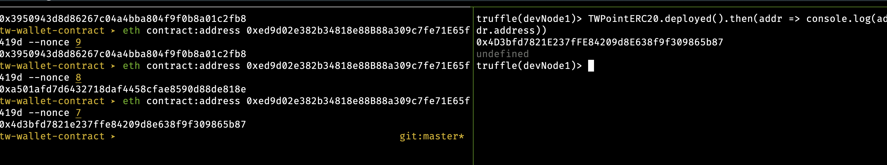
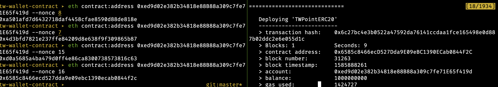

# TW wallet Contract
TW Points 对应的erc20的智能合约

## Tool
eth-cli 是以太坊命令行工具，也可以用于在 quorum 节点上，完成查看合约地址，调用合约方法。

### 安装 eth-cli
```
$ npm install -g eth-cli
```

### 查看网络
```
$ eth networks 
Id     Name    Label   Url
1      mainnet Mainnet https://mainnet.infura.io/v3/76fb6c10f1584483a45a0a28e91b07ad
3      ropsten Ropsten https://ropsten.infura.io/v3/76fb6c10f1584483a45a0a28e91b07ad
4      rinkeby Rinkeby https://rinkeby.infura.io/v3/76fb6c10f1584483a45a0a28e91b07ad
5      goerli  Görli   https://goerli.infura.io/v3/76fb6c10f1584483a45a0a28e91b07ad
42     kovan   Kovan   https://kovan.infura.io/v3/76fb6c10f1584483a45a0a28e91b07ad
```

### 添加网络
```
$ eth network:add quorum --url http://quorum.tw-wallet.in2e.com:22000 --id 88 --label Quorum

$ eth networks                                                                                                          
Id     Name    Label   Url
1      mainnet Mainnet https://mainnet.infura.io/v3/76fb6c10f1584483a45a0a28e91b07ad
3      ropsten Ropsten https://ropsten.infura.io/v3/76fb6c10f1584483a45a0a28e91b07ad
4      rinkeby Rinkeby https://rinkeby.infura.io/v3/76fb6c10f1584483a45a0a28e91b07ad
5      goerli  Görli   https://goerli.infura.io/v3/76fb6c10f1584483a45a0a28e91b07ad
42     kovan   Kovan   https://kovan.infura.io/v3/76fb6c10f1584483a45a0a28e91b07ad
88     quorum  Quorum  http://quorum.tw-wallet.in2e.com:22000
```

### 添加账户
```
eth address:add quorum 0xed9d02e382b34818e88b88a309c7fe71e65f419d -n quorum
```

### 查看某账户的合约地址，nonce 是该账户已经发送的 transaction 的数量
```
eth contract:address 0xed9d02e382b34818e88B88a309c7fe71E65f419d --nonce 16
```

这里的 —nonce 16 参数很重要，因为它会影响 contract address 的生成结果。举个例子，上面这条命令生成的结果如下：
0x6585c8466ecd527dda9e09ebc1390ecab0844f2c

如果我们改成了 —nonce 11 参数，就会得到另外的结果。
```
eth contract:address 0xed9d02e382b34818e88B88a309c7fe71E65f419d --nonce 11
0xb81c1fea49fab3687941a4fb31027eabd98e66dc — 这就是徐进部署的最新合约的地址
```

这次输出的结果就不同了，说明 contract address 是会收到 nonce 的影响的，而 nonce 就是 fromAdress 对应账户 transaction 的总数，我们可以通过 web3.eth.getTransactionCount(fromAddress) 获得 fromAddress 的 nonce 值，而 transaction 的 index 是从 0 开始递增的，所以我们通过 getTransactionCount(fromAddress) 得到的就是下一次 tx 的 index，也就是当前这次的 nonce 值。

下面的截图也佐证我的观点。





### 调用合约的方法
```
eth contract:call -n quorum erc20@0x4D3bfd7821E237fFE84209d8E638f9f309865b87 "balanceOf('0xed9d02e382b34818e88b88a309c7fe71e65f419d')"
```

## 使用自研命令行工具

使用方法
1. 需要在config文件里面配置私钥
./cli/quorum.js transfer -t 0xcA843569e3427144cEad5e4d5999a3D0cCF92B8e -m 9.9 --config config.local.quorum.js 

2. 只能在node节点有的账号转账，可以设置password
./cli/quorum.js transferWithPassword -t 0xcA843569e3427144cEad5e4d5999a3D0cCF92B8e -m 9.9 --config config.local.quorum.js 

3. 查看命令基本信息
./cli/quorum.js

4. 帮助文档
./cli/quorum.js help transfer 
